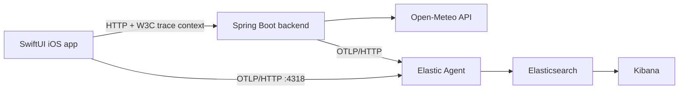

# EDOT iOS demo

This repository demonstrates the
[Elastic Distribution of OpenTelemetry iOS](https://github.com/elastic/apm-agent-ios) in an
end-to-end weather application.

The app mirrors the EDOT Android demo: choose a city, request its current weather through a local
instrumented backend, and inspect the complete distributed trace in Elastic. It also includes
focused examples of manual spans, logs, metrics, a slow trace, an intentional backend error, and an
intentional iOS crash.

## What you can observe

- Distributed traces from a SwiftUI action through `URLSession`, the Java backend, and Open-Meteo.
- Automatic iOS lifecycle, view controller, network, CPU, and memory telemetry.
- A custom parent span, correlated log records, span attributes, and application counters.
- A backend error when New York is selected.
- A deliberately slow request from the Telemetry Lab.
- A persisted crash report exported after the app is relaunched.

## Components



- `WeatherDemo/` contains the SwiftUI application. It uses EDOT iOS and the OpenTelemetry API.
- `backend/` contains a Spring Boot service instrumented by the EDOT Java runtime attach library.
- Elastic `start-local` provides Elasticsearch, Kibana, and an Elastic Agent OTLP endpoint.

## Prerequisites

- macOS with Xcode and an iOS 16 or newer Simulator.
- Docker Desktop or another Docker environment available to the macOS host.
- Java 17 or newer. Gradle can provision a matching toolchain when necessary.

## Run the demo

### 1. Start the Elastic Stack

From the repository root:

```sh
curl -fsSL https://elastic.co/start-local | sh -s -- --edot
```

This creates an ignored `elastic-start-local/` directory and starts Elasticsearch, Kibana, and the
Elastic Agent. The app is already configured to send OTLP/HTTP telemetry to
`http://localhost:4318`.

The generated scripts can stop or restart the stack later:

```sh
./elastic-start-local/stop.sh
./elastic-start-local/start.sh
```

### 2. Start the instrumented backend

```sh
./backend-manager start
```

The script builds the backend, creates its Docker image, connects it to the start-local network, and
waits for `http://localhost:8080/v1/health`.

Other commands:

```sh
./backend-manager logs
./backend-manager stop
./backend-manager uninstall
```

### 3. Run the iOS application

Open `WeatherDemo.xcodeproj` in Xcode, select an iPhone Simulator, and run the `WeatherDemo` scheme.
The first package resolution downloads EDOT iOS and its Swift Package Manager dependencies.

In the Weather tab:

1. Select Berlin, London, or Paris and tap **Show forecast** for a successful distributed trace.
2. Select New York for the intentional backend error.

In the Telemetry tab:

1. Create a custom span, log, and metric.
2. Run the slow distributed trace.
3. Use **Crash the app**, then relaunch the app so EDOT iOS can export the stored crash report.

## Inspect the data

Open [Kibana](http://localhost:5601) and sign in as `elastic`. The password is printed by
start-local and stored as `ES_LOCAL_PASSWORD` in `elastic-start-local/.env`.

Useful service names:

- `weather-demo-ios`
- `weather-demo-backend`

Search for span names such as `Fetch city forecast`, `Manual checkout simulation`, or the
`demo.action` attribute. Metrics from the app include `demo.forecast.requests` and
`demo.manual.actions`.

## Simulator and physical-device networking

The iOS Simulator can reach services on the Mac through `localhost`, so the checked-in configuration
works without changes. A physical device cannot. To use one:

1. Change `collectorURL` and `backendURL` in
   `WeatherDemo/Configuration/DemoConfiguration.swift` to the Mac's LAN address.
2. Ensure ports `4318` and `8080` are reachable through the Mac firewall.
3. Keep the device and Mac on the same network.

The app permits clear-text traffic because all demo endpoints are local HTTP services. Do not carry
that App Transport Security exemption into a production application.

## Configuration

The agent is initialized with OTLP/HTTP because start-local exposes the collector at port `4318`:

```swift
let configuration = AgentConfigBuilder()
  .withExportUrl(URL(string: "http://localhost:4318")!)
  .useConnectionType(.http)
  .withRemoteManagement(false)
  .build()

ElasticApmAgent.start(with: configuration)
```

`Info.plist` sets:

```text
service.name=weather-demo-ios,deployment.environment=local
```

## Validate changes

Run both the backend checks and a code-signing-free Simulator build:

```sh
./checks.sh
```

## License

Apache License 2.0. See `LICENSE` and `NOTICE.txt`.
