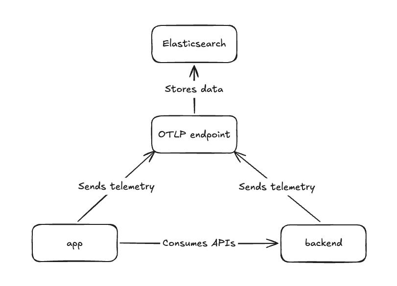

# EDOT iOS demo

This repository demonstrates the
[Elastic Distribution of OpenTelemetry iOS](https://github.com/elastic/apm-agent-ios) (EDOT iOS) in
an end-to-end weather application. See the
[EDOT iOS documentation](https://www.elastic.co/docs/reference/opentelemetry/edot-sdks/ios) for the
full agent reference.

Choose a city, request its current weather through a local instrumented backend, and inspect the
complete distributed trace in Elastic. The demo also includes focused examples of manual spans,
logs, an intentional backend error, and an intentional iOS crash.

## Table of contents

- [What you can observe](#what-you-can-observe)
- [Components](#components)
  - [Backend service](#backend-service)
  - [iOS application](#ios-application)
  - [Elastic Agent](#elastic-agent)
- [Prerequisites](#prerequisites)
- [Run the demo](#run-the-demo)
  - [1. Start the Elastic Stack](#1-start-the-elastic-stack)
  - [2. Start the instrumented backend](#2-start-the-instrumented-backend)
  - [3. Run the iOS application](#3-run-the-ios-application)
- [Inspect the data](#inspect-the-data)
- [Simulator and physical-device networking](#simulator-and-physical-device-networking)
- [Configuration](#configuration)
- [License](#license)

## What you can observe

- Distributed traces from a SwiftUI action through `URLSession`, the backend, and Open-Meteo.
- Automatic iOS lifecycle, view controller, network, CPU, and memory telemetry
  ([supported technologies](https://www.elastic.co/docs/reference/opentelemetry/edot-sdks/ios/supported-technologies)).
- A custom parent span, correlated log records, and span attributes.
- A backend error when New York is selected.
- A persisted crash report exported after the app is relaunched.

## Components



### Backend service

A simple Spring Boot service that provides APIs for the application and helps showcasing the
distributed tracing use case. It is instrumented by the EDOT Java runtime attach library, and its
source is maintained in
[elastic/shared-otel-sdk-demo](https://github.com/elastic/shared-otel-sdk-demo/tree/main/backend).

### iOS application

Located in the [WeatherDemo](WeatherDemo) directory. The Weather screen has a city picker and a
**Show forecast** button that takes you to the forecast screen, where you'll see the selected
city's current temperature. If you pick a non-European city, you'll get an error from the (local)
backend when you head to the forecast screen. This is to demonstrate how network and backend errors
are captured and correlated. The app can also crash itself intentionally so you can inspect iOS
crash reporting in Kibana.

### Elastic Agent

The [Elastic Agent](https://www.elastic.co/docs/reference/fleet/elastic-agent-as-otel-collector)
provides the OTLP endpoint that receives telemetry from the iOS application and backend service,
then forwards it to Elasticsearch for storage and analysis. In this demo, it is set up automatically
as part of [Step 1](#1-start-the-elastic-stack) via start-local.

## Prerequisites

- macOS with Xcode and an iOS 16 or newer Simulator.
- Docker Desktop or another Docker environment available to the macOS host.

## Run the demo

### 1. Start the Elastic Stack

We use [start-local](https://github.com/elastic/start-local/) to spin up Elasticsearch, Kibana and
the Elastic Agent locally with a single command. In this setup, the Elastic Agent provides the OTLP
endpoint that receives telemetry from the iOS application and backend service. Run this command
from the repository root:

```sh
curl -fsSL https://elastic.co/start-local | sh -s -- --edot
```

This creates an `elastic-start-local/` directory and starts Elasticsearch, Kibana, and the
Elastic Agent. The app is already configured to send OTLP/HTTP telemetry to
`http://localhost:4318`.

You can stop and start the services later with the scripts in the `elastic-start-local` folder:

```sh
./elastic-start-local/stop.sh   # stop the services
./elastic-start-local/start.sh  # start them again
```

For more information on start-local, refer to
the [start-local documentation](https://github.com/elastic/start-local/).

### 2. Start the instrumented backend

We're going to use the `backend-manager` script, which will pull the pre-built
[backend](https://github.com/elastic/shared-otel-sdk-demo/tree/main/backend) Docker image from
`ghcr.io` and run it connected to the same network as the Elastic Agent.

Once the backend service is running, its endpoint will be `http://localhost:8080/v1/`. You don't
need to set it for this demo application, as it has already been done
[here](WeatherDemo/Configuration/DemoConfiguration.swift). So, once the backend service is running,
you're ready to go to the next step.

Execute the [backend-manager](backend-manager) script. You can do so by opening up a terminal,
navigating to this directory and running the following command:

```sh
./backend-manager start
```

To see the backend logs:

```sh
./backend-manager logs
```

To stop the backend:

```sh
./backend-manager stop
```

To stop the backend and remove the Docker image from your machine:

```sh
./backend-manager uninstall
```

### 3. Run the iOS application

Open `WeatherDemo.xcodeproj` in Xcode, select an iPhone Simulator, and run the `WeatherDemo` scheme.
The first package resolution downloads EDOT iOS and its Swift Package Manager dependencies.

Once everything is running, navigate around in the app to generate some load that we would like to
observe in Elastic APM. So, select Berlin, London, or Paris, tap **Show forecast** and repeat it
multiple times. To see the intentional error path, select New York and tap **Show forecast**. The
backend rejects that city on purpose, which gives you an error trace to inspect and correlate with
the iOS-side request.

To demonstrate iOS crash reporting, tap the crash button in the toolbar. The app will close
intentionally. Launch it again so EDOT iOS can export the stored crash report.

## Inspect the data

After launching the app and navigating through it, open [Kibana](http://localhost:5601) and log in
with username `elastic` and the password printed at the end of the start-local setup. You can also
find the password in `elastic-start-local/.env` (the `ES_LOCAL_PASSWORD` variable).

Useful service names:

- `weather-demo-ios`
- `weather-demo-backend`

Search for span names such as `Fetch city forecast`.

The [Elastic APM documentation](https://www.elastic.co/docs/solutions/observability/apm) explains
the Applications UI in depth. If telemetry does not arrive, see
[troubleshooting the EDOT iOS agent](https://www.elastic.co/docs/troubleshoot/ingest/opentelemetry/edot-sdks/ios).

## Simulator and physical-device networking

The iOS Simulator can reach services on the Mac through `localhost`, so the checked-in configuration
works without changes. A physical device cannot. To use one:

1. Change `collectorURL` and `backendURL` in
   `WeatherDemo/Configuration/DemoConfiguration.swift` to the Mac's LAN address.
2. Ensure ports `4318` and `8080` are reachable through the Mac firewall.
3. Keep the device and Mac on the same network.

The app permits clear-text traffic because all demo endpoints are local HTTP services. Do not carry
that App Transport Security exemption into a production application.

## Configuration

The agent is initialized with OTLP/HTTP because start-local exposes the collector at port `4318`:

```swift
let configuration = AgentConfigBuilder()
  .withExportUrl(URL(string: "http://localhost:4318")!)
  .useConnectionType(.http)
  .withRemoteManagement(false)
  .build()

ElasticApmAgent.start(with: configuration)
```

`Info.plist` sets:

```text
service.name=weather-demo-ios,deployment.environment=local
```

## License

Apache License 2.0. See [`LICENSE`](LICENSE).
